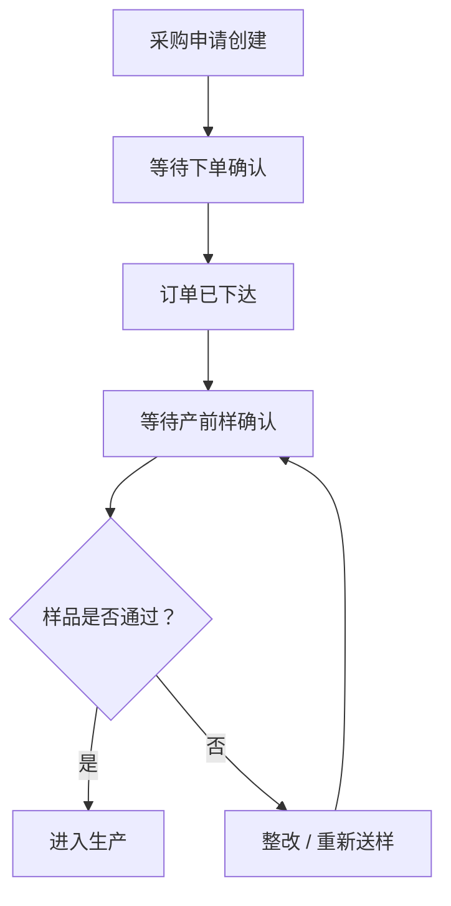
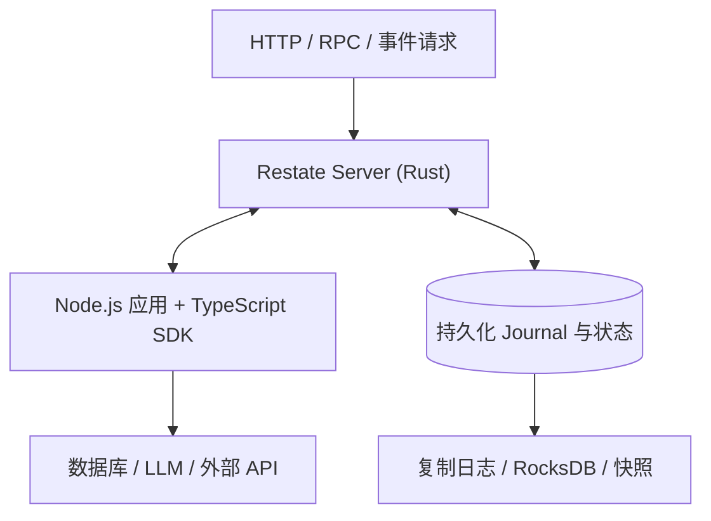
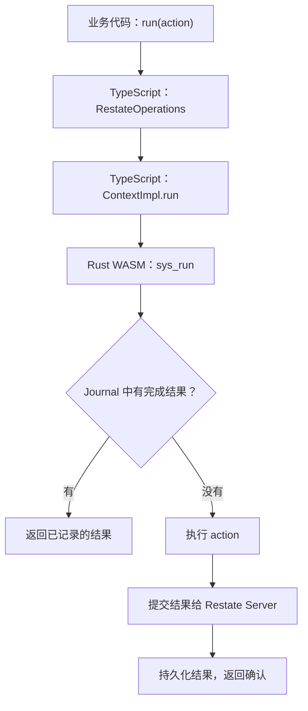
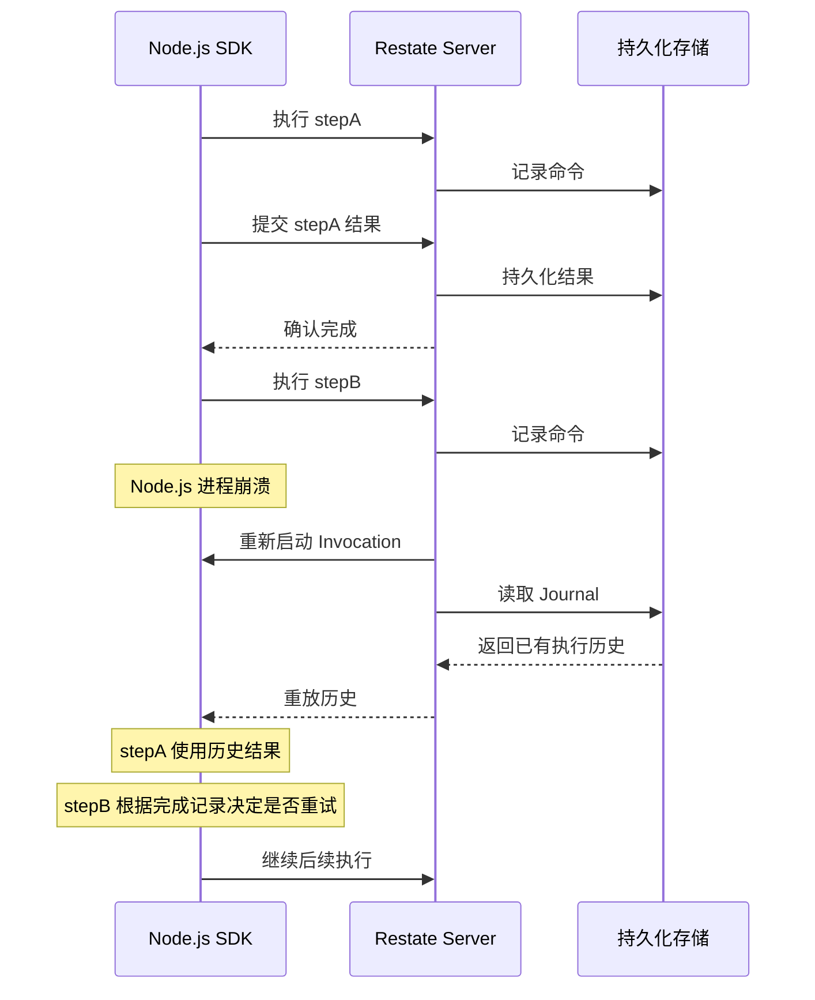

```mermaid
flowchart TD
    A["采购申请创建"] --> B["等待下单确认"]
    B --> C["订单已下达"]
    C --> D["等待产前样确认"]
    D --> E{"样品是否通过？"}
    E -->|是| F["进入生产"]
    E -->|否| G["整改 / 重新送样"]
    G --> D
```

```mermaid
flowchart TB
    A["HTTP / RPC / 事件请求"] --> B["Restate Server (Rust)"]
    B <--> C["Node.js 应用 + TypeScript SDK"]
    C --> D["数据库 / LLM / 外部 API"]
    B <--> E[("持久化 Journal 与状态")]
    E --> F["复制日志 / RocksDB / 快照"]
```

```mermaid
flowchart TD
    A["业务代码：run(action)"] --> B["TypeScript：RestateOperations"]
    B --> C["TypeScript：ContextImpl.run"]
    C --> D["Rust WASM：sys_run"]
    D --> E{"Journal 中有完成结果？"}
    E -->|有| F["返回已记录的结果"]
    E -->|没有| G["执行 action"]
    G --> H["提交结果给 Restate Server"]
    H --> I["持久化结果，返回确认"]
```

```mermaid
sequenceDiagram
    participant N as Node.js SDK
    participant R as Restate Server
    participant S as 持久化存储

    N->>R: 执行 stepA
    R->>S: 记录命令
    N->>R: 提交 stepA 结果
    R->>S: 持久化结果
    R-->>N: 确认完成

    N->>R: 执行 stepB
    R->>S: 记录命令
    Note over N: Node.js 进程崩溃

    R->>N: 重新启动 Invocation
    R->>S: 读取 Journal
    S-->>R: 返回已有执行历史
    R-->>N: 重放历史

    Note over N: stepA 使用历史结果
    Note over N: stepB 根据完成记录决定是否重试

    N->>R: 继续后续执行
```
